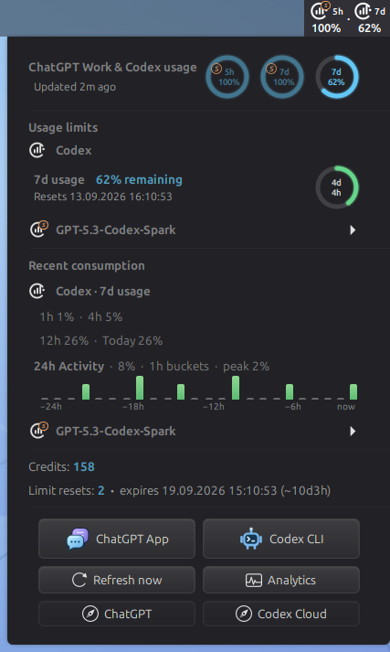
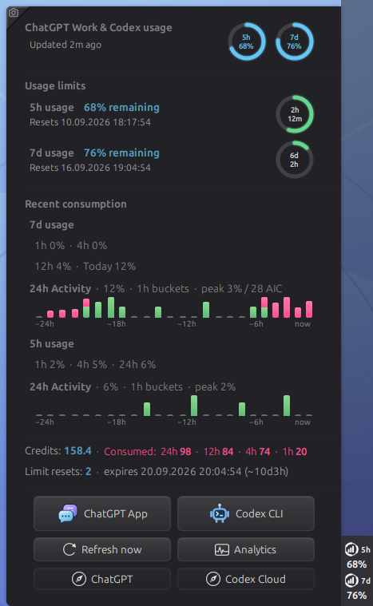
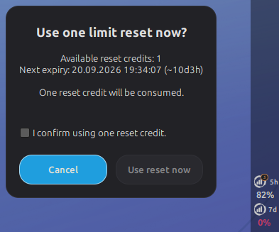

<p align="center">
  <picture>
    
  </picture>
</p>

<h1 align="center">ChatGPT Usage for Cinnamon</h1>

<p align="center">
  Live ChatGPT Work and Codex limits, reset times and credits in one compact
  Cinnamon applet — adaptive on horizontal and vertical panels.
</p>

<p align="center">
  <a href="https://github.com/oss-singularity/cinnamon-chatgpt-usage/actions/workflows/check.yml"></a>
  <a href="LICENSE"></a>
  
  
</p>


| Horizontal top bar with Spark + Codex panel indicators                                                     | 40 px vertical panel with Spark + Codex panel indicators                                                       |
| ---------------------------------------------------------------------------------------------------------- | -------------------------------------------------------------------------------------------------------------- |
|  |  |

| Default overview with unused Spark collapsed                                                                             | Spark quotas and recent activity                                                                                                            |
| ------------------------------------------------------------------------------------------------------------------------ | ------------------------------------------------------------------------------------------------------------------------------------------- |
|  |  |

<p align="center"><sub>Public usage-menu captures keep the live panel edge and applet indicators visible as the visual anchor; general dual-model examples show both model-specific indicators.</sub></p>

<p align="center"><strong>Default overview on a horizontal panel</strong></p>
<p align="center">
  
</p>
<p align="center"><sub>Unused Spark stays compact on either panel orientation; positive quota usage opens the upper section and restores its header rings.</sub></p>

<p align="center"><strong>Conditional four-ring quota state</strong></p>
<p align="center">
  
</p>
<p align="center"><sub>The account-wide Codex 5h ring appears only when the signed-in account exposes that quota.</sub></p>

<p align="center"><strong>Common Codex-only two-window state</strong></p>
<p align="center">
  
</p>
<p align="center"><sub>When Spark is not available, the compact state shows only the Codex 5h and 7d windows.</sub></p>

<p align="center"><strong>Explicit earned-reset confirmation</strong></p>
<p align="center">
  
</p>
<p align="center"><sub>An available reset is consumed only after this native confirmation; the compact top panel keeps the two model indicators visible.</sub></p>

| Precise hourly bucket details                                                                                    | Every active quota at a glance                                                                                  |
| ---------------------------------------------------------------------------------------------------------------- | --------------------------------------------------------------------------------------------------------------- |
|  |  |

| ChatGPT desktop app guidance                                                                                        | Codex CLI guidance                                                                                              |
| ------------------------------------------------------------------------------------------------------------------- | --------------------------------------------------------------------------------------------------------------- |
|  |  |

| General settings with model-specific panel limits enabled                                            | Colors and thresholds beside both model-specific panel indicators                                    |
| ---------------------------------------------------------------------------------------------------- | ---------------------------------------------------------------------------------------------------- |
|  |  |

## Highlights

- Mirrors account-level and named model-specific limits exposed by ChatGPT:
  remaining usage, reset times, credits and earned resets with the next expiry
  date, time and remaining countdown when available. An available earned reset
  can be selected in the popup and is consumed only after an explicit native
  confirmation; a zero reset count stays compact and shows only `0`.
- Detects dedicated GPT-5.3-Codex-Spark 5h and 7d quotas automatically when
  they are enabled for the signed-in account. The Spark quota section starts
  collapsed when neither window has consumption and opens when either window
  has positive usage. Click its heading or use the keyboard to toggle it;
  refreshes preserve that choice while the popup is open. Both Spark header
  rings are muted while neither window is in use. Spark carries a
  distinct amber marker and can optionally be added to the panel.
- Shows paired circular available-quota and reset-countdown indicators for
  every active 5h and 7d window without polling the API more often. Untouched
  100%-remaining cycles stay at their exact full duration until usage begins;
  hovering a reset-countdown circle shows the elapsed percentage of its own
  5h or 7d reset window.
- Tracks observed consumption for the last 1h and 4h plus an exact rolling 24h
  total for active 5h quotas; weekly quotas retain 12h and Today context. The
  compact timeline offers per-bucket hover details for the last 24 hours, and
  a rounded-zero Spark 7d bucket can use a clearly marked, smallest-height
  estimate from the more sensitive 5h history. Two-hour buckets remain
  selectable in settings, and Spark's summaries share one chart in their
  native expandable section, which opens automatically after recent activity.
- Launches an installed ChatGPT desktop app or Codex CLI directly, with native
  installation guidance when either is missing. The usage backend prefers the
  configured/PATH Codex CLI and can alternatively discover the app-server
  binary bundled with the ChatGPT desktop app, so the app alone is sufficient
  on supported Linux packages. Web shortcuts cover ChatGPT, Codex Cloud and
  ChatGPT Analytics. The ChatGPT launch tooltip interprets the observed date
  segment in the desktop version (`YY.MDD`) and falls back to the installed
  executable's local package/update timestamp when that format is unavailable;
  neither is an upstream publication-date guarantee.
- Shows `5h` automatically only when an active API limit exposes that window;
  an accompanying `7d` panel block can be hidden in settings while unnamed
  internal buckets stay hidden.
- Adapts from a compact horizontal row to a real 40 px vertical stack.
- Uses the original ChatGPT knot as a transparent white panel glyph.
- Follows Cinnamon's system 12 / 24-hour clock preference and local time zone.
- Offers native settings for refresh rate, colors, thresholds, labels, icon,
  font size and Codex CLI path.
- Highlights critical remaining usage (10% or less by default) with one
  configurable color shared by the quota ring, its label and the remaining
  text. The default is static neon pink for readability.
- Can notify once when selected 7d limits refresh and when enabled 5h or 7d
  quotas cross configurable warning and critical remaining-usage thresholds;
  all detection happens only on successful data refreshes.
- Replaces stale usage with a compact sign-in message when Codex reports that
  its ChatGPT login is missing or expired, both at startup and after logout.

## Installation

```bash
git clone https://github.com/oss-singularity/cinnamon-chatgpt-usage.git
cd cinnamon-chatgpt-usage
./install.sh
```

Then open **System Settings → Applets** and add **ChatGPT Usage** to a panel.
Requirements: Cinnamon 5.8+, Python 3 and either a current
[Codex CLI](https://learn.chatgpt.com/docs/codex/cli#getting-started) signed in
with ChatGPT or a supported ChatGPT desktop app package. The Linux ChatGPT
package can provide the local app-server backend by itself; the applet discovers
its bundled `resources/codex` binary when no configured/PATH CLI is available.
If neither option is installed, both native launch/install buttons remain
available as the initial setup choice.
Version 0.3.9 is tested on Cinnamon 6.6.9 with Codex CLI 0.153.2 and ChatGPT
desktop 26.901.31953.

Run `./install.sh` again after updates. `./uninstall.sh` removes the applet while
retaining its settings.

## How it works

The helper makes one read-only `account/rateLimits/read` request through the
official local Codex app-server for normal refreshes and exits. An earned reset
is never consumed in the background: the confirmed popup action starts a
separate `account/rateLimitResetCredit/consume` request with one UUID
idempotency key and then refetches the complete usage snapshot. There is no
HTML scraping, API key, browser access or background daemon. To calculate recent
consumption, it stores only timestamps, window durations, percentages and reset
IDs for eight days in `$XDG_STATE_HOME/cinnamon-chatgpt-usage/history.json`
(normally `~/.local/state/...`, mode `0600`). No prompts, credit details or
credentials are recorded. A leading `~` marks periods that started before local
tracking began. Project code never reads Codex credential files; authentication
and networking remain the responsibility of the selected local app-server
backend (Codex CLI or the supported ChatGPT desktop bundle).

## Development

```bash
make check
python3 chatgpt_usage.py
```

Local checks and GitHub Actions cover Cinnamon JavaScript, API normalization,
formatting, JSON, assets and shell scripts.

## License

Licensed under GPL-3.0-or-later. See [LICENSE](LICENSE).

The bundled Yaru action icons retain their CC-BY-SA-4.0 license;
see [icon attribution](icons/ATTRIBUTION.md).
Report vulnerabilities privately as described in [SECURITY.md](SECURITY.md).

The adaptive layout follows the OSS-SINGULARITY
[Adaptive System Monitor](https://github.com/oss-singularity/cinnamon-system-monitor)
approach. See [ATTRIBUTION.md](ATTRIBUTION.md). OpenAI, ChatGPT and Codex are
trademarks of OpenAI; this community project is not affiliated with OpenAI.
