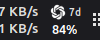
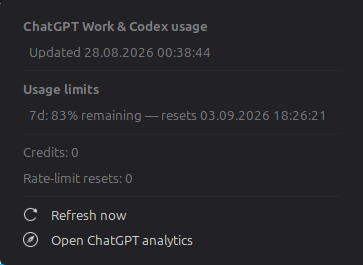
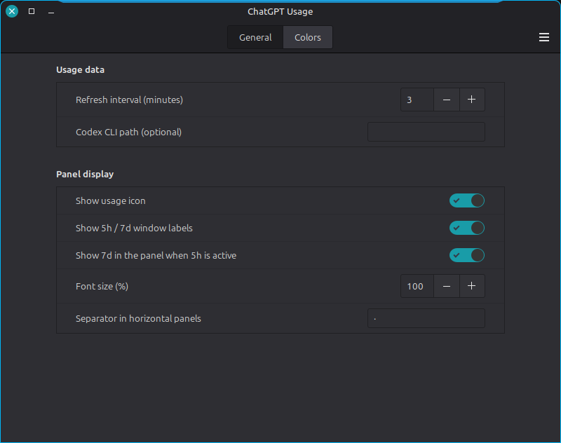
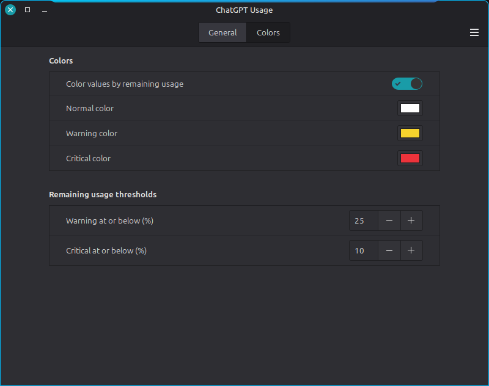

<p align="center">
  
</p>

<h1 align="center">ChatGPT Usage for Cinnamon</h1>

<p align="center">
  Live ChatGPT Work and Codex limits, reset times and credits in one compact
  Cinnamon applet — adaptive on horizontal and vertical panels.
</p>

<p align="center">
  <a href="https://github.com/oss-singularity/cinnamon-chatgpt-usage/actions/workflows/check.yml"></a>
  <a href="LICENSE"></a>
  
  
</p>

| Horizontal top bar                     | 40 px vertical panel                                      |
| -------------------------------------- | --------------------------------------------------------- |
|  |  |



| General settings                               | Colors and thresholds                       |
| ---------------------------------------------- | ------------------------------------------- |
|  |  |

## Highlights

- Mirrors the canonical limit cards from ChatGPT Analytics: remaining usage,
  reset times, credits and earned resets.
- Shows `5h` automatically only when that account-level Analytics window is
  active; its accompanying `7d` panel block can be hidden in settings while
  internal model-only buckets stay hidden.
- Adapts from a compact horizontal row to a real 40 px vertical stack.
- Uses the original ChatGPT knot as a transparent white panel glyph.
- Follows Cinnamon's system 12 / 24-hour clock preference and local time zone.
- Offers native settings for refresh rate, colors, thresholds, labels, icon,
  font size and Codex CLI path.

## Installation

```bash
git clone https://github.com/oss-singularity/cinnamon-chatgpt-usage.git
cd cinnamon-chatgpt-usage
./install.sh
```

Then open **System Settings → Applets** and add **ChatGPT Usage** to a panel.
Requirements: Cinnamon 5.8+, Python 3 and a current Codex CLI signed in with
ChatGPT. Version 0.1.0 is tested on Cinnamon 6.6.9 with Codex CLI 0.150.1.

Run `./install.sh` again after updates. `./uninstall.sh` removes the applet while
retaining its settings.

## How it works

The helper makes one read-only `account/rateLimits/read` request through the
official local Codex app-server and exits. There is no HTML scraping, API key,
browser access, background daemon, local usage database or reset-credit write.
Project code never reads Codex credential files; authentication and networking
remain the Codex CLI's responsibility.

## Development

```bash
make check
python3 chatgpt_usage.py
```

Local checks and GitHub Actions cover Cinnamon JavaScript, API normalization,
formatting, JSON, assets and shell scripts.

## License

Licensed under GPL-3.0-or-later. See [LICENSE](LICENSE).
Report vulnerabilities privately as described in [SECURITY.md](SECURITY.md).

The adaptive layout follows the OSS-SINGULARITY
[Adaptive System Monitor](https://github.com/oss-singularity/cinnamon-system-monitor)
approach. See [ATTRIBUTION.md](ATTRIBUTION.md). OpenAI, ChatGPT and Codex are
trademarks of OpenAI; this community project is not affiliated with OpenAI.
