<p align="center">
  <picture>
    
  </picture>
</p>

<h1 align="center">ChatGPT Usage for Cinnamon</h1>

<p align="center">
  Live ChatGPT Work and Codex limits, reset times and credits in one compact
  Cinnamon applet — adaptive on horizontal and vertical panels.
</p>

<p align="center">
  <a href="https://github.com/oss-singularity/cinnamon-chatgpt-usage/actions/workflows/check.yml"></a>
  <a href="LICENSE"></a>
  
  
</p>


| Horizontal top bar with Spark + Codex blocks                                    | 40 px vertical panel with both blocks                                               |
| ------------------------------------------------------------------------------- | ----------------------------------------------------------------------------------- |
| 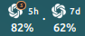 | 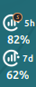 |

| Full 24-hour usage overview                                                                           | Compact Spark histories                                                                                       |
| ----------------------------------------------------------------------------------------------------- | ------------------------------------------------------------------------------------------------------------- |
| 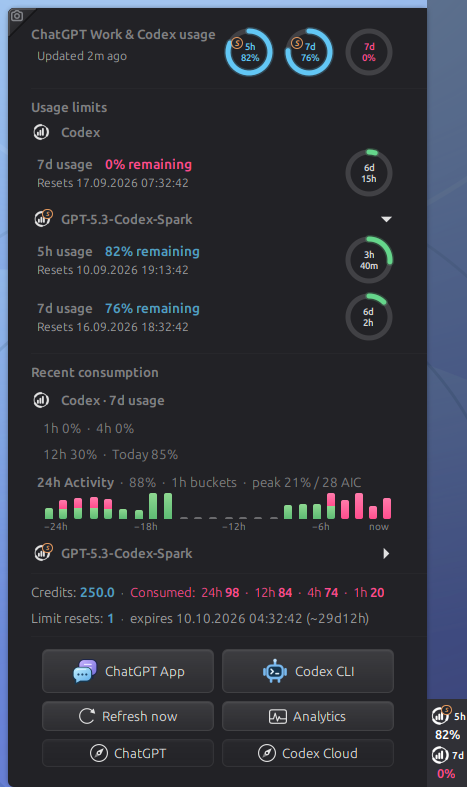 | 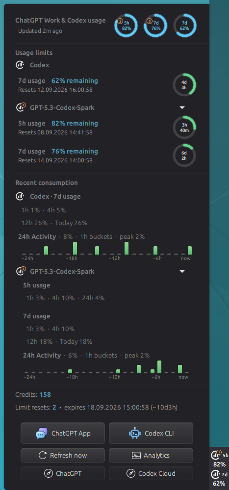 |

<p align="center"><strong>Conditional four-ring quota state</strong></p>
<p align="center">
  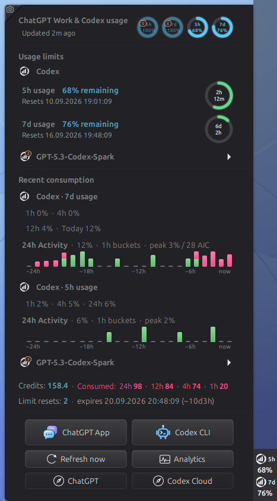
</p>
<p align="center"><sub>The account-wide Codex 5h ring appears only when the signed-in account exposes that quota.</sub></p>

| Precise hourly bucket details                                                                 | Every active quota at a glance                                                               |
| --------------------------------------------------------------------------------------------- | -------------------------------------------------------------------------------------------- |
| 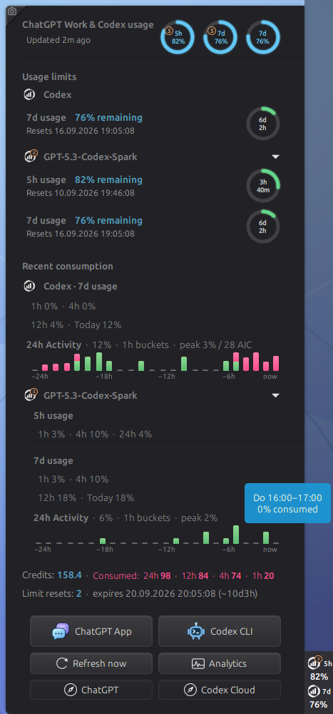 | 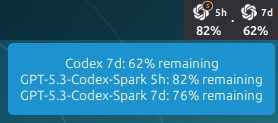 |

| ChatGPT desktop app guidance                                                                     | Codex CLI guidance                                                                           |
| ------------------------------------------------------------------------------------------------ | -------------------------------------------------------------------------------------------- |
| 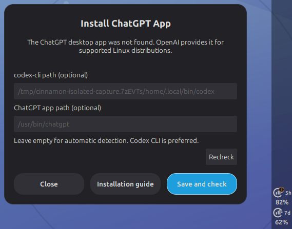 | 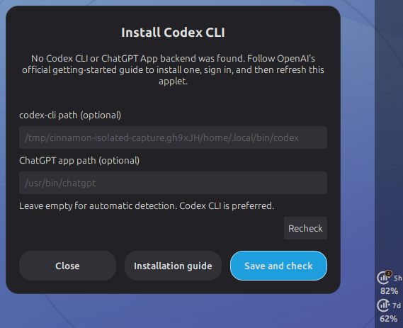 |

| General settings with model-specific panel limits enabled                                            | Colors and thresholds beside both panel blocks                                    |
| ---------------------------------------------------------------------------------------------------- | --------------------------------------------------------------------------------- |
| 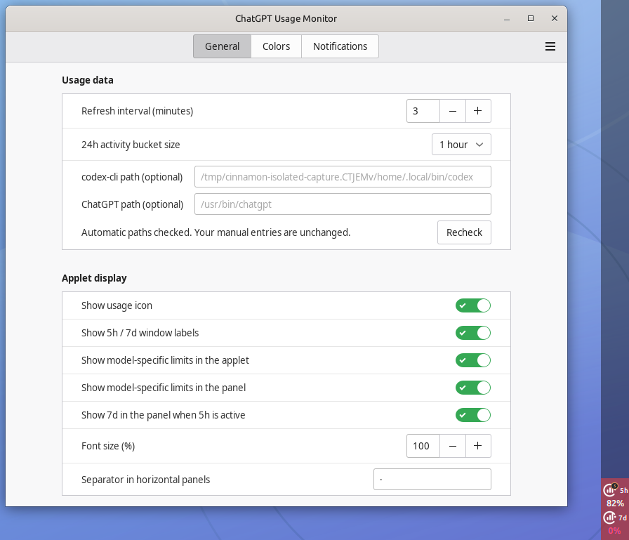 | 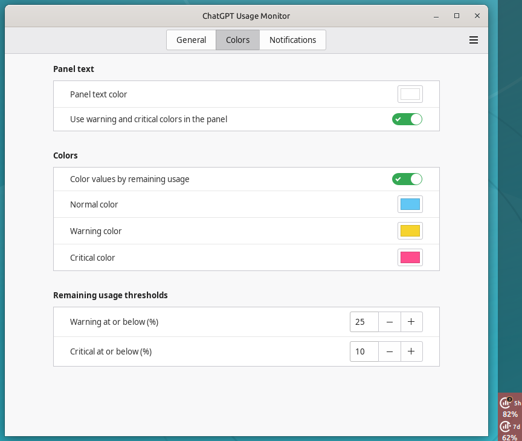 |

## Highlights

- Mirrors account-level and named model-specific limits exposed by ChatGPT:
  remaining usage, reset times, credits and earned resets.
- Detects dedicated GPT-5.3-Codex-Spark 5h and 7d quotas automatically when
  they are enabled for the signed-in account; model-specific limits stay in
  the popup by default, carry a distinct amber marker and can optionally be
  added to the panel.
- Shows paired circular available-quota and reset-countdown indicators for
  every active 5h and 7d window without polling the API more often. Untouched
  100%-remaining cycles stay at their exact full duration until usage begins.
- Tracks observed consumption for the last 1h and 4h plus an exact rolling 24h
  total for active 5h quotas; weekly quotas retain 12h and Today context. The
  compact timeline offers per-bucket hover details for the last 24 hours, and
  a rounded-zero Spark 7d bucket can use a clearly marked, smallest-height
  estimate from the more sensitive 5h history. Two-hour buckets remain
  selectable in settings, and Spark's summaries share one chart in their
  native expandable section, which opens automatically after recent activity.
- Launches an installed ChatGPT desktop app or Codex CLI directly, with native
  installation guidance when either is missing. Web shortcuts cover ChatGPT,
  Codex Cloud and ChatGPT Analytics. The ChatGPT launch tooltip interprets the
  observed date segment in the desktop version (`YY.MDD`) and falls back to the
  installed executable's local package/update timestamp when that format is
  unavailable; neither is an upstream publication-date guarantee.
- Shows `5h` automatically only when an active API limit exposes that window;
  an accompanying `7d` panel block can be hidden in settings while unnamed
  internal buckets stay hidden.
- Adapts from a compact horizontal row to a real 40 px vertical stack.
- Uses the original ChatGPT knot as a transparent white panel glyph.
- Follows Cinnamon's system 12 / 24-hour clock preference and local time zone.
- Offers native settings for refresh rate, colors, thresholds, labels, icon,
  font size and Codex CLI path.
- Can notify once when selected 7d limits refresh and when enabled 5h or 7d
  quotas cross configurable warning and critical remaining-usage thresholds;
  all detection happens only on successful data refreshes.
- Replaces stale usage with a compact sign-in message when Codex reports that
  its ChatGPT login is missing or expired, both at startup and after logout.

## Installation

```bash
git clone https://github.com/oss-singularity/cinnamon-chatgpt-usage.git
cd cinnamon-chatgpt-usage
./install.sh
```

Then open **System Settings → Applets** and add **ChatGPT Usage** to a panel.
Requirements: Cinnamon 5.8+, Python 3 and a current
[Codex CLI](https://learn.chatgpt.com/docs/codex/cli#getting-started) signed in
with ChatGPT. Version 0.3.5 is tested on Cinnamon 6.6.9 with Codex CLI 0.152.0.

Run `./install.sh` again after updates. `./uninstall.sh` removes the applet while
retaining its settings.

## How it works

The helper makes one read-only `account/rateLimits/read` request through the
official local Codex app-server and exits. There is no HTML scraping, API key,
browser access, background daemon or reset-credit write. To calculate recent
consumption, it stores only timestamps, window durations, percentages and reset
IDs for eight days in `$XDG_STATE_HOME/cinnamon-chatgpt-usage/history.json`
(normally `~/.local/state/...`, mode `0600`). No prompts, credit details or
credentials are recorded. A leading `~` marks periods that started before local
tracking began. Project code never reads Codex credential files; authentication
and networking remain the Codex CLI's responsibility.

## Development

```bash
make check
python3 chatgpt_usage.py
```

Local checks and GitHub Actions cover Cinnamon JavaScript, API normalization,
formatting, JSON, assets and shell scripts.

## License

Licensed under GPL-3.0-or-later. See [LICENSE](LICENSE).
Report vulnerabilities privately as described in [SECURITY.md](SECURITY.md).

The adaptive layout follows the OSS-SINGULARITY
[Adaptive System Monitor](https://github.com/oss-singularity/cinnamon-system-monitor)
approach. See [ATTRIBUTION.md](ATTRIBUTION.md). OpenAI, ChatGPT and Codex are
trademarks of OpenAI; this community project is not affiliated with OpenAI.
